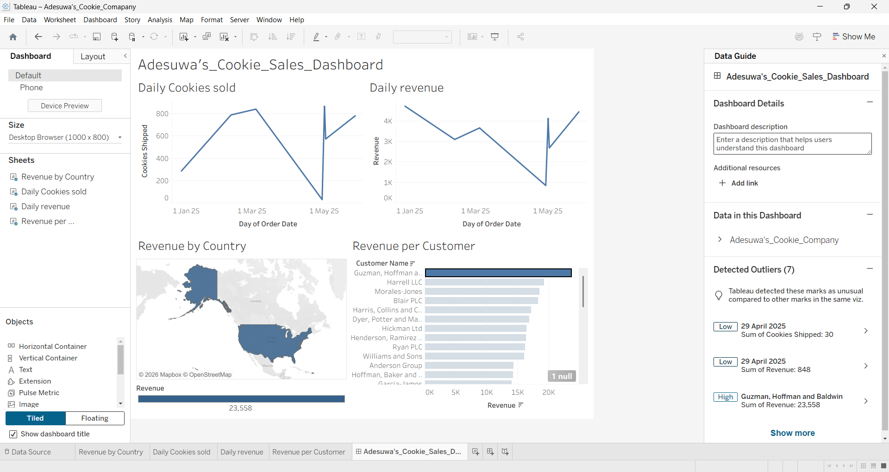

# Cookie_Company_Tableau_1

<h2>Dashboard Preview</h2>

  

## Project Overview

This project is an interactive Tableau dashboard developed to analyze Cookie Company sales data and present key business metrics in a clear and visually engaging format. The dashboard enables users to monitor daily sales activity, track revenue trends, compare revenue across countries, and identify the company's highest-value customers.

The dashboard was created using Tableau Desktop with Microsoft Excel as the data source and demonstrates practical business intelligence and data visualization techniques.

## Project Objective

The objective of this project was to transform raw sales data into an interactive dashboard that provides meaningful insights into the company's performance. The dashboard helps users monitor revenue, evaluate customer contributions, identify geographic trends, and analyze daily sales activity to support data-driven decision-making.

---

## Dataset

The dashboard uses a Microsoft Excel dataset containing fictional Cookie Company sales transactions.

The dataset includes information such as:

- Order Date
- Customer Name
- Country
- Revenue
- Cookies Shipped

---

## Dashboard Features

### Daily Cookies Sold

Displays the number of cookies shipped each day, allowing users to identify sales fluctuations and daily demand trends.

### Daily Revenue

Visualizes daily revenue over time to monitor business performance and identify high and low revenue periods.

### Revenue by Country

A filled map showing total revenue generated in each country, making it easy to compare regional performance.

### Revenue per Customer

Ranks customers by total revenue, helping identify the highest-value customers and their contribution to overall sales.

---

## Tools Used

- Tableau Desktop
- Microsoft Excel
- Tableau Maps
- Data Visualization
- Business Intelligence

---

## Key Insights

- Daily sales and revenue fluctuate significantly throughout the reporting period.
- The United States generates the highest revenue among the countries shown.
- A small number of customers contribute a significant portion of total revenue.
- Geographic visualizations make it easy to compare regional sales performance.
- Interactive Tableau dashboards allow users to explore sales data more effectively than static reports.

---

## Skills Demonstrated

- Data Cleaning and Preparation
- Dashboard Design
- Interactive Data Visualization
- Business Intelligence
- KPI Reporting
- Geographic Data Visualization
- Time Series Analysis
- Customer Sales Analysis
- Data Storytelling

---

## Business Value

This dashboard provides business users with a centralized view of key sales metrics by enabling them to:

- Monitor daily revenue performance.
- Track daily sales volume.
- Identify top revenue-generating customers.
- Compare revenue across countries.
- Support strategic business decisions using interactive visualizations.

---

## Repository Contents

- `Adesuwa's_Cookie_Company.twbx` – Tableau workbook
- `Cookie_Company_Sales_Data.xlsx` – Source dataset
- `dashboard.png` – Dashboard preview
- `README.md` – Project documentation

---

## Live Dashboard

The interactive dashboard is available on Tableau Public:

**Tableau Public:** *https://public.tableau.com/app/profile/adesuwa.robert/viz/Adesuwas_Cookie_Comapany/Adesuwas_Cookie_Sales_Dashboard*

---

## Author

**Adesuwa Robert**

Information Technology student with an interest in Data Analytics, Business Intelligence, and Data Visualization.
